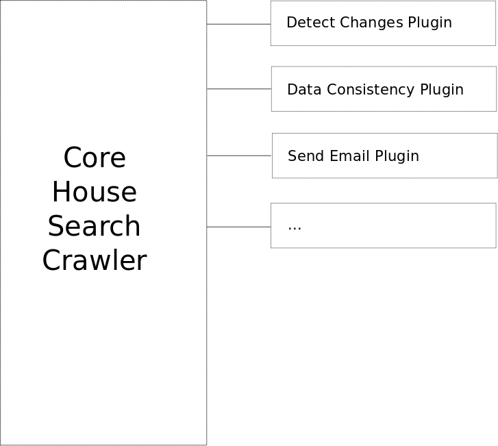

# Dublin House Search

Personal project created to keep searching houses in Dublin that matches different criteria. The motivation for the project came from situation of the house rental in Dublin where it is very hard to find a place. When you find something you like, you have to go on a viewing with hundreds with other people and hope you are the granted the grace of being selected by the landlord or agent.

The software keeps searching for houses on daft.ie and when somerhing is found it sends a notification that can be acted on potentially giving an advange by being one of the first applicants. It has a few advantages over the proprietary website and app:

- It gives a more fine grained search options, allowing complex search criterias to be constructed.
- Includes a geographical search that allow to specify exact areas of the city (by using latitude and longitude).

The project has a few learning purposes:

- Use multithreading
- Exercise modularity
- Extensibility (by using Java's `ServiceLoader`)

## Architecture overview

### Core House Search Crawler
This module reads all the properties available on daft.ie and call the plugins to oprocess each property. This task is done in two steps:

- First the website interface is used to get the list of properties
- Each property page is retrieved to extract all the data

Different threads are responsible for doing this in the following way:

- Producer threads retrieve the list of Rental, Sharing and Sale porperties in one thread for each property type and stores it on concurrent collections.
- Multile consumer/procucer threads consume the list of properties and extract the data for each property and produce the collection of property data, again stored in concurrent colllections.
- Multiple consumer threads now consume the property data and pass it to the plugins to be processed.

The data extraction grabs the data fro the webpages because there is no public API for using the data.

### Plugins
Due to the ad-hoc nature of the architecture new plugins can be implemented and deployed without the need to change the core crawler. Each plugin is independent of each other.